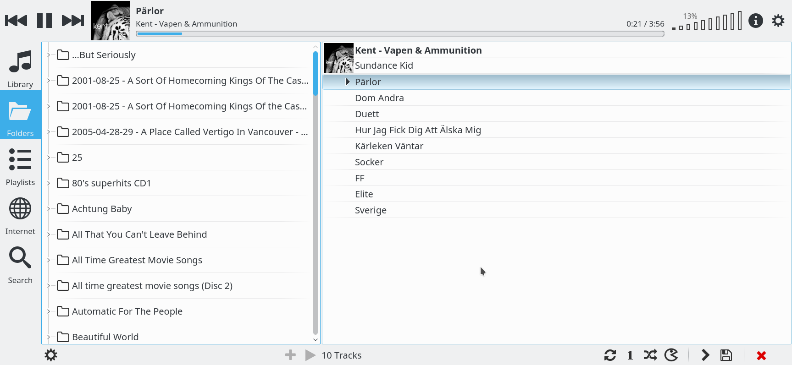

# socompd
A minimal implementation of mpd that relay commands to Sonos. So this program acts as a mpd proxy i.e. you can use a mpd client for controlling your Sonos device.

This is work in progress

# Installing

* You need https://github.com/bosim/SoCo
* A mpd client (ideally Cantata)
* Python 3.4+

Create a virtualenv

     $ mkdir src/socompd
     $ virtualenv .
     $ source bin/activate

Now get the required components

     (socompd) $ git clone https://github.com/bosim/SoCo.git
     (socompd) $ cd SoCo
     (socompd) $ python setup.py install
     (socompd) $ git clone https://github.com/bosim/socompd.git
     (socompd) $ cd socompd
     (socompd) $ python socompd.py

Connect with your mpd client to localhost:9999, notice this only works with one sonos device right now. On the todo list
to be able to select the sonos device.

# What works?

* Playing, stopping, forward, previous on play controls
* Controlling the volume
* Browsing the library
* Showing the queue and partially also modifying it

Most things rely on the events system in sonos, i.e. if you change the volume it will immediately be propagated. Therefore you need an mpd client with IDLE support for optimal conditions. 

# Tested client

* Cantata 2.0.0, most things works, except for library, but folders can be browsed.

# Author

* Bo Simonsen <bo@geekworld.dk>
